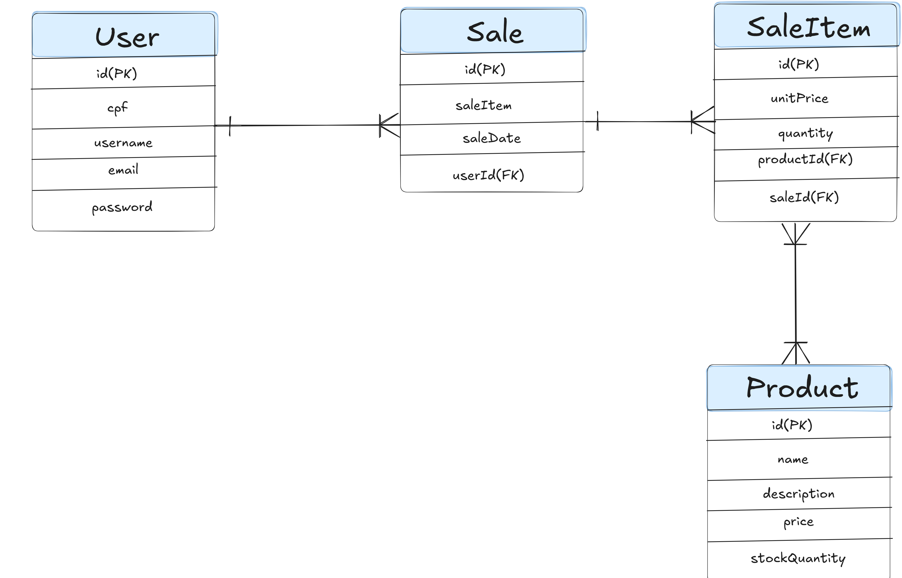

# Teste Estágio TGID

Este repositório contém um projeto backend desenvolvido em **Java 21** como parte de um processo seletivo para estágio na TGID.

---

## Tecnologias Utilizadas

- **Java 21**
- **Hibernate 6.5.2**
- **PostgreSQL 42.7.3**
- **BCrypt 0.10.2**
- **Docker** + **Docker Compose**

---

##  Como Rodar o Projeto

1. **Clone o repositório:**
   ```bash
   git clone https://github.com/Matheus7p/Tgid-teste
   cd Tgid-teste
   ```

2. **Rode o comando para baixar as dependências.**
    ```bash
   mvn clean install  
    ```

3. **Execute o projeto com Docker Compose:**
   ```bash
   docker-compose up --build
   ```

4. **Em seguida, todo o log do sistema aparecerá no terminal**

---

## Modelo Lógico do Banco de dados



